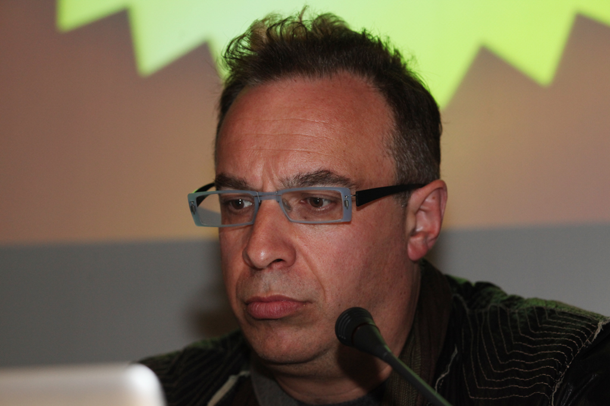
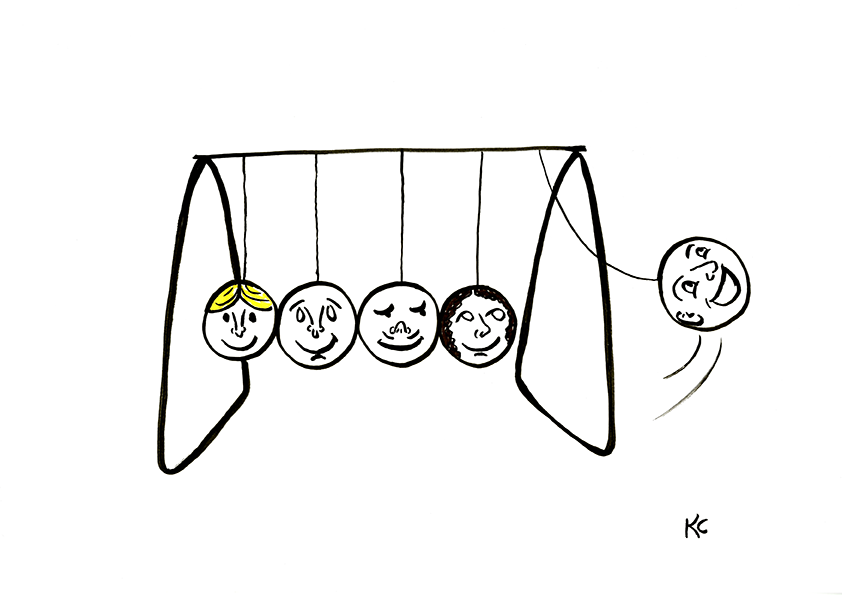
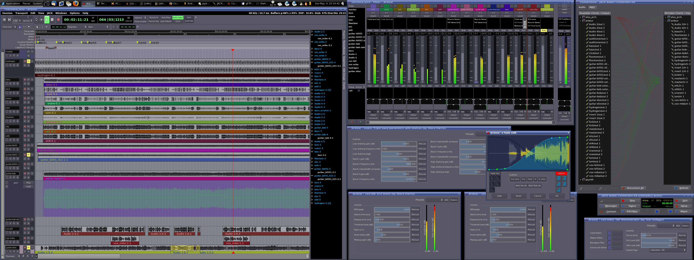

# PEC3 — Manovich Reloaded: Visionando el futuro con las gafas de Manovich

**Autor:** Antonio Julián Bueno Fuentes  
**Asignatura:** 20.644 - Cultura Digital (UOC)  
**Fecha:** Mayo 2026  
**Repositorio:** `PEC3_Manovich_Reloaded`  
**Licencia:** Creative Commons CC BY-SA 4.0  

---

## 1. Planteamiento y marco teórico

La hibridación, según Manovich, no consiste en yuxtaponer capas multimedia — texto junto a imagen junto a vídeo, cada uno conservando sus estructuras originales — sino en la fusión profunda de técnicas, interfaces y estructuras de datos de dos o más medios previamente separados para dar lugar a una nueva "especie" de medio. En palabras del propio Manovich: *«Las interfaces y técnicas exclusivas de distintos medios se convierten en elementos de software que pueden combinarse por vías antes imposibles»* (Manovich, 2013). La multimedia tradicional superpone; la hibridación copula y muta.

Con estas gafas, el presente ensayo analiza dos casos contemporáneos — ninguno de los dos documentado en la obra original de Manovich — donde los principios del software como metamedio se manifiestan de forma especialmente clara: **The Johnny Cash Project** (Chris Milk, 2010) y **BandLab**. Ambos permiten observar cómo la hibridación genera nuevas estéticas, nuevas lógicas de autoría y nuevas formas de relación entre el ser humano y la máquina de medios.

*Foto: Lev Manovich. Dominio público / Wikimedia Commons.*

---

## 2. Metodología

El análisis de los dos casos se estructura aplicando los cinco principios de los nuevos medios formulados por Manovich (2013):

1. **Representación numérica** y transcodificación cultural
2. **Modularidad**
3. **Automación**
4. **Variabilidad**
5. **El software como metamedio**

En cada caso se describen primero las características del medio y, a continuación, se interpretan desde cada una de estas categorías teóricas. Se incluye una valoración personal al final de cada sección.

---

## 3. Caso 1 — The Johnny Cash Project (Chris Milk, 2010): Crowdsourcing como medio vivo

### 3.1. Descripción del caso

En 2010, Chris Milk lanzó *The Johnny Cash Project* (thejohnnycashproject.net), una plataforma web colaborativa creada como vídeo musical para *Ain't No Grave*, canción grabada en 2003 por Johnny Cash —una resurrección artística póstuma, en cierto modo—. El proyecto invitaba a cualquier persona del mundo a dibujar un fotograma individual mediante una interfaz web simplificada. Esas aportaciones se almacenaban en una base de datos y un algoritmo las ensamblaba para componer el vídeo final. Cash murió en 2003; el proyecto es, en cierto modo, una resurrección artística posdata. Pero lo verdaderamente significativo no es el tributo en sí, sino lo que el software hace posible: una nueva forma de autoría colectiva que disuelve la frontera entre creador y espectador.

*Foto: Chris Milk. CC BY-SA / Wikimedia Commons.*

### 3.2. Análisis con las gafas de Manovich

#### Representación numérica y transcodificación cultural

Cada fotograma dibujado por un voluntario es, para el sistema, un objeto numérico: coordenadas vectoriales en una base de datos, parámetros de color, temporalidad. La expresión creativa humana se transcodifica en datos procesables por la máquina. Simultáneamente, la capa cultural —la herencia musical de Johnny Cash, la narrativa country y folk— se convierte en una estructura de datos temporal que determina el ritmo y la secuencia del ensamblaje. El archivo musical deja de ser experiencia auditiva para convertirse en una variable algorítmica. El concepto de **remezclabilidad profunda** de Manovich (2013) describe precisamente esta operación: los medios se mezclan a nivel de técnicas y estructuras de datos, no de superficies estéticas.

#### Modularidad

Cada fotograma es una unidad independiente y autocontenida dentro de la base de datos. El sistema los trata como elementos discretos que pueden sustituirse, combinarse o recombinarse sin límite. Esta estructura modular es la que permite que miles de voluntarios trabajen simultáneamente sin coordinación centralizada: no necesitan conocer el trabajo de los demás para que el resultado emerja. La imagen inferior ilustra el concepto de colaboración distribuida aplicado a la creación cultural.

*Imagen: Representación del concepto de crowdsourcing colaborativo. CC BY-SA / Wikimedia Commons.*

#### Automatización

El proceso de ensamblaje no lo realiza ningún editor humano. El software selecciona, ordena y reproduce los fotogramas siguiendo un algoritmo que responde a la lógica de la música y a la base de datos disponible. El papel del algoritmo es tan central que el propio Milk lo describía como un "director" que orquesta una orquesta sin conocer a ninguno de sus músicos. La automatización aquí no sustituye al creador humano: lo replace por un sistema donde la acción humana se canaliza a través de la máquina.

#### Variabilidad

Cada vez que alguien visita la web, el algoritmo genera una versión ligeramente diferente del vídeo. El resultado no es un archivo fijo, sino un sistema generativo en permanente evolución. No hay una versión "definitiva": hay un proceso. Esto convierte la experiencia de visionado en algo que ningún otro medio —ni el cine, ni el vídeo tradicional, ni siquiera YouTube— había permitido hasta entonces.

#### El software como metamedio

*The Johnny Cash Project* no es simplemente "un vídeo con participación". Es un espacio donde el medio audiovisual, la intervención humana y el algoritmo de composición constituyen un único sistema donde las aportaciones individuales solo adquieren significado en relación con el todo. La autoría se dispersa, el resultado es inacabable, la estética emerge de la tensión entre lo particular y lo colectivo. Es, literalmente, un medio que no existía antes de la convergencia de estos elementos.

### 3.3. Valoración personal

Lo que más me impresiona de este proyecto es cómo la tecnología permite que una herramienta de expresión individual —el dibujo— se convierta en un acto de construcción colectiva sin necesidad de coordinación explícita. El software no es un simple intermediario: es el medio que hace posible algo que no existiría sin él. Hay algo casi filosófico en cómo el sistema convierte miles de actos de expresión personal en un objeto compartido que es más que la suma de sus partes. Tras analizarlo con las gafas de Manovich, me resulta revelador que la hibridación no sea aquí un recurso estético, sino la condición misma de existencia del proyecto.

---

## 4. Caso 2 — BandLab: La plataforma que fusiona creación, producción y distribución musical en el navegador

### 4.1. Descripción del caso

BandLab (bandlab.com) es una plataforma de creación musical que funciona íntegramente en el navegador. Nació en 2017 como alternativa gratuita y colaborativa a los DAW (*digital audio workstations*) tradicionales como Ableton, FL Studio o Pro Tools, que requieren instalación local y suelen tener un coste elevado. BandLab fusiona en una única interfaz un editor multipista, herramientas de red social, funciones de inteligencia artificial y un ecosistema de distribución y colaboración en tiempo real. Se presenta como "la red social de la música". Esta descripción es significativa: no se trata de una aplicación de música con funciones sociales añadidas, sino de un espacio donde la creación, la distribución y la interacción social constituyen un flujo integrado.

*Logo: BandLab Technologies. CC BY / Wikimedia Commons.*

La imagen inferior muestra un ejemplo de interfaz de software de producción musical (DAW), contexto tecnológico relevante para comprender cómo BandLab transforma y hibrida estas herramientas.

*Imagen: Interfaz de Ardour, DAW de código abierto. CC BY-SA / Wikimedia Commons.*

### 4.2. Análisis con las gafas de Manovich

#### Representación numérica y transcodificación cultural

El gesto musical —la interpretación humana de una melodía— se convierte en datos: archivos WAV, clips MIDI, parámetros de efectos. Esos datos pueden editarse con una precisión imposible en un instrumento analógico, distribuirse instantáneamente y volver a convertirse en sonido en cualquier dispositivo con navegador web. La transcodificación opera en ambos sentidos: los datos se reconvierten en experiencia sensorial —audio— que viaja por la red hasta el oído del oyente. Y la capa cultural —la tradición musical, los géneros, los estilos— se convierte en información organizable, etiquetable, recomponible por el software.

#### Modularidad

BandLab estructura el flujo de trabajo musical en módulos independientes: cada canción contiene pistas, y cada pista contiene clips de audio, MIDI, efectos e instrumentos virtuales. Los *samples* y bucles se almacenan como unidades que pueden combinarse y recombinarse sin límite en ningún otro proyecto. El usuario construye la pieza como quien construye con bloques, donde cada bloque puede reutilizarse en otros contextos. Esta modularidad es idéntica en concepto —aunque diferente en escala— a la modularidad que Manovich identifica en los medios informáticos en general.

#### Automatización

BandLab incorpora funciones impulsadas por IA desde 2020: mezcla automática, sugerencias armónicas, *mastering* por inteligencia artificial y la posibilidad de generar melodías o ritmos a partir de prompts textuales. El sistema no solo ejecuta instrucciones, sino que anticipa y propone. Esto reconfigura el rol del músico: de ejecutante técnico a director de un proceso en el que el software es interlocutor activo. Esta automatización va más allá de la mera eficiencia: introduce una nueva forma de diálogo entre el ser humano y la máquina.

#### Variabilidad

Las múltiples versiones de una canción pueden coexistir. Los *forks* (bifurcaciones) permiten que otros usuarios creen variaciones a partir de una pista pública. El proyecto musical nunca tiene una versión "definitiva": es un proceso en permanente revisión, navegable y editable por cualquier colaborador con acceso.

#### El software como metamedio

BandLab no replica un estudio de grabación, ni una plataforma de streaming, ni una red social. Crea un espacio nuevo donde la creación, la producción, la distribución y la interacción social son facetas de una única experiencia mediada por software. Las antiguas distinciones entre compositor, productor, distribuidor y oyente se disuelven: un músico puede escribir una melodía, otro añadir una pista de bajo, otro masterizar la mezcla, y todo ocurre dentro del mismo entorno sin exportar ni importar archivos. El software no es un instrumento que辅助 un proceso preexistente: es el medio mismo que hace posible y define ese proceso. Aquí la remezclabilidad profunda de Manovich se manifiesta en la fusión de las técnicas del estudio de grabación, la red social y la IA generativa en un único entorno computacional.

### 4.3. Valoración personal

Lo que me parece más revelador de BandLab es cómo el software no se limita a reproducir lo que ya existía —un estudio de grabación—, sino que crea algo fundamentalmente nuevo. La posibilidad de que una canción nazca, se produzca y se distribuya desde el mismo entorno cambia la relación entre creación y publicación: ya no son fases separadas, sino un flujo continuo. Y la presencia de herramientas de IA como interlocutor creativo plantea preguntas genuinas sobre la authorship que aún no tenemos respuesta. Al analizarlo con Manovich, lo que más destaca es que BandLab encarna la redefinición de las categorías tradicionales de la música: compositor, productor, oyente y distribuidor ya no son roles fijos, sino funciones fluidamente interconvertibles dentro del mismo medio.

---

## 5. Conclusiones

Ambos casos demuestran que la hibridación, tal como la describe Manovich, no es un fenómeno estético ni superficial, sino estructural. En *The Johnny Cash Project*, la hibridación se produce entre la creación colectiva, el algoritmo compositor y el archivo musical, generando un medio en permanente evolución. En BandLab, la hibridación fusiona la composición, la producción, la distribución y la socialización en un flujo integrado. En ambos casos, el resultado no es la suma de sus partes: es una nueva gestalt mediática que solo existe porque el software la hace posible.

Estos dos ejemplos muestran que la hibridación sigue siendo el motor principal de la innovación en la cultura digital, y que bien podrían figurar en una hipotética segunda edición de *El software toma el mando*.

---

## 6. Referencias

- Manovich, L. (2013). *El software toma el mando*. Ariel.
- Manovich, L. (2013). "Deep remixability". En *El software toma el mando*, cap. 3.
- Adell, F. (2024). *Nuevos medios y cultura digital*. Materiales de la UOC.
- Chris Milk / The Johnny Cash Project (2010). https://www.thejohnnycashproject.net
- BandLab Technologies (2024). https://bandlab.com

### Procedencia de las imágenes

| Imagen | Fuente | Licencia |
|--------|--------|----------|
| Lev Manovich | Wikimedia Commons | Dominio público |
| Chris Milk | Wikimedia Commons | CC BY-SA 3.0 |
| BandLab Logo | Wikimedia Commons | CC BY-SA 3.0 |
| Ardour DAW | Wikimedia Commons | CC BY-SA 3.0 |
| Crowdsourcing | Wikimedia Commons | CC BY-SA 3.0 |

---

*Nota sobre el uso de IA: Este documento ha sido elaborado con apoyo de herramientas de IA (ChatGPT, 2024) para la selección temática, la supervisión sintáctica, la documentación de datos y la verificación de citas. Se ha seguido la guía de citación de IA de la UOC.*